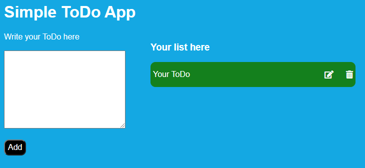

# Simple To Do App

## Description
This simple ToDo app program will let you add a ToDo list. This repository features the usage of JavaScript, CSS styling for looks and object placement. After you finish typing your item in the box below "write your ToDo here", click on the button "Add" to see your item saved on the right column. You can enter as many item as you'd like.

How to use: Once the repository is deployed (https://dfgav1r1a.github.io/bustracker) this simple ToDo app will be loaded. You will have a box where you can type the item that you would like to include in your ToDo list at the right column. To include the item, please click the "Add" button. You will se that an item will appear to your right with 2 icons, one to edit the item and one to delete the item. When you click on the icon 'edit', the text will go back to the box ready to be edited, once you are done, click on the "Add" button to put the item back again on the list. To delete, simply click on the 'trash' icon.

## Improvement Roadmap
1) Centering the items on the page.
2) Make the app mobile friendly so the user can also use this app on mobile devices.
3) Add a save feature that the user could use to store the list on the computer.

## License
Please refer to the LICENSE file included in the repository. This app is authorized for commercial use, modification, distribution and private use. In other words, feel free to use it as you would like to, no strings attached.